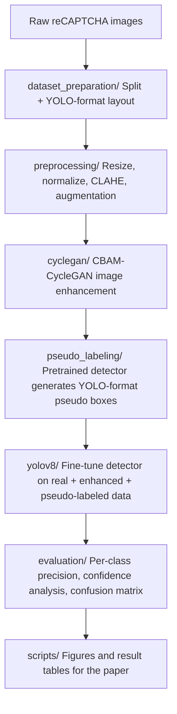
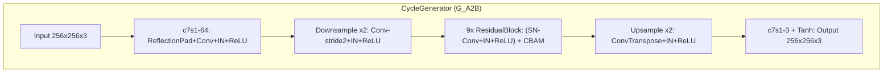

# Breaking reCAPTCHAv2: A CBAM-CycleGAN Augmented YOLOv8 Pipeline for Automated Image-Based CAPTCHA Solving

This repository contains the full implementation, dataset preparation
pipeline, and experimental code accompanying the study *"Breaking
reCAPTCHAv2"*, which investigates the robustness of image-based reCAPTCHAv2
challenges against an automated object-detection pipeline enhanced with
GAN-based image translation and pseudo-labeling.

## Abstract

Image-based CAPTCHA systems such as Google's reCAPTCHAv2 rely on the
assumption that fine-grained visual object recognition under noisy,
low-resolution, and stylistically inconsistent conditions remains
significantly harder for automated systems than for humans. This work
challenges that assumption by proposing an end-to-end pipeline that
combines (i) an attention-augmented, spectrally normalized CycleGAN for
domain-specific image enhancement, (ii) a pseudo-labeling stage that
transfers bounding-box annotations from a general-purpose pretrained
detector onto the enhanced synthetic images, and (iii) a YOLOv8 object
detector fine-tuned on the resulting augmented dataset. We show that this
combination of learned image enhancement and semi-supervised label
propagation improves detection confidence and coverage on reCAPTCHAv2-style
imagery relative to training on the raw, unenhanced corpus alone.

## 1. Pipeline Overview



*(GitHub renders the diagram above automatically since it uses a fenced
`mermaid` code block — no extra image file is required.)*

## 2. CycleGAN Image-Enhancement Module

### 2.1 Architecture

| Component | Design | Reference |
|---|---|---|
| Generator (`CycleGenerator`) | ResNet-style encoder-bottleneck-decoder, 9 residual blocks, reflection padding, instance normalization | Johnson et al. (2016); Zhu et al. (2017) |
| Attention | Convolutional Block Attention Module (channel + spatial attention) inside every residual block | Woo et al. (2018) |
| Discriminator (`PatchDiscriminator`) | 70x70 PatchGAN, 5 convolutional layers | Isola et al. (2017); Zhu et al. (2017) |
| Stabilization | Spectral normalization on every convolution in the generator's residual blocks and in the discriminator | Miyato et al. (2018) |
| Perceptual loss | Multi-layer VGG16 (ImageNet-pretrained, frozen) feature L1 distance | Johnson et al. (2016) |
| Adversarial loss | Least-squares GAN (LSGAN) objective | Mao et al. (2017) |



### 2.2 Objective function

For a raw input image `x` (domain A) and its CycleGAN-transformed
counterpart `G_A2B(x)` (domain B):

```
L_G  = L_adv(D_B, G_A2B(x))
     + lambda_cycle * ||G_B2A(G_A2B(x)) - x||_1
     + lambda_perc  * L_perceptual(G_A2B(x), x)

L_D  = 0.5 * [ (D_B(x) - 1)^2 + (D_B(G_A2B(x).detach()))^2 ]
```

| Hyperparameter | Default | Notes |
|---|---|---|
| `lambda_cycle` | 10.0 | Weight of the cycle-consistency term |
| `lambda_perc` | 1.0 | Weight of the VGG16 perceptual term |
| Learning rate | 2e-4 | Adam, beta1=0.5, beta2=0.999 |
| Epochs | 10 | Reduced training subset (Colab-scale compute) |
| Batch size | 1 | Per-image instance-normalization statistics |
| Residual blocks | 9 | Standard for 256x256 inputs |

### 2.3 Algorithm

```text
Algorithm 1: CBAM-CycleGAN training with LSGAN + cycle-consistency + perceptual loss
------------------------------------------------------------------------------------
Input:  Raw image set X = {x_1, ..., x_N}
        Generators G_A2B, G_B2A ; Discriminator D_B
        Hyperparameters: lambda_cycle, lambda_perc, lr, epochs E
Output: Trained generator G_A2B

 1: Initialize G_A2B, G_B2A, D_B with random weights
 2: Initialize optimizer_G over (G_A2B, G_B2A) parameters, optimizer_D over D_B
 3: for epoch = 1 to E do
 4:     for each mini-batch x ~ X do
 5:         # ---- Generator update ----
 6:         fake_B  <- G_A2B(x)
 7:         rec_A   <- G_B2A(fake_B)
 8:         L_adv   <- MSE( D_B(fake_B), 1 )                        # LSGAN loss
 9:         L_cyc   <- L1( rec_A, x ) * lambda_cycle                 # cycle-consistency
10:         L_perc  <- VGG16_L1( fake_B, x ) * lambda_perc            # perceptual loss
11:         L_G     <- L_adv + L_cyc + L_perc
12:         Backpropagate L_G, update G_A2B, G_B2A via optimizer_G
13:
14:         # ---- Discriminator update ----
15:         L_real  <- MSE( D_B(x), 1 )
16:         L_fake  <- MSE( D_B(fake_B.detach()), 0 )
17:         L_D     <- 0.5 * (L_real + L_fake)
18:         Backpropagate L_D, update D_B via optimizer_D
19:     end for
20:     Log epoch-average (L_G, L_D) to loss_log.csv
21:     Save checkpoint {G_A2B, G_B2A, D_B, optimizers, config}
22: end for
23: return G_A2B
```

This pseudocode corresponds directly to `cyclegan/train_cyclegan.py`
(the generator and discriminator update steps), and is suitable for direct
inclusion as a numbered algorithm box in the manuscript's Methodology
section.

### 2.4 Why CBAM + spectral normalization

The training corpus available for this task is orders of magnitude smaller
than the datasets typically used to train CycleGAN (e.g. Cityscapes,
Horse2Zebra - tens of thousands of images). Under low-data regimes, vanilla
CycleGAN training is prone to discriminator over-confidence and generator
mode collapse. Spectral normalization constrains the Lipschitz constant of
each discriminator (and generator residual) layer, which empirically
stabilizes the minimax game under small-batch, small-dataset conditions.
CBAM is added so the generator's capacity is spent selectively on
informative spatial regions and channels rather than uniformly re-texturing
the whole tile - particularly relevant given the small-object nature of
several target classes (e.g. traffic lights, hydrants).

## 3. Repository Structure

```
paper_Breaking_reCaptchav2/
├── README.md                          # this file
├── requirements.txt                   # pinned Python dependencies
├── .gitignore
│
├── dataset_preparation/
│   ├── download_data.py               # dataset acquisition (Kaggle source)
│   ├── split_train_val_test.py        # stratified train/val split + YOLO dir layout
│   └── README.md
│
├── preprocessing/
│   ├── resize_normalize.py            # resizing, normalization
│   ├── augmentation.py                # CLAHE, unsharp masking, geometric augmentation
│   └── README.md
│
├── cyclegan/
│   ├── models.py                      # CBAM, CycleGenerator, PatchDiscriminator, PerceptualLoss
│   ├── dataset.py                     # image loading utilities
│   ├── train_cyclegan.py              # training entry point (CLI, checkpointing)
│   ├── generate_synthetic.py          # inference: raw -> enhanced image generation
│   ├── cyclegan_recaptcha.ipynb       # original exploratory notebook (full pipeline)
│   └── README.md                      # architecture, objective function, hyperparameters
│
├── pseudo_labeling/
│   ├── generate_pseudo_labels.py      # COCO-pretrained detector -> YOLO-format labels
│   ├── label_filtering.py             # confidence-based filtering of pseudo labels
│   └── README.md
│
├── yolov8/
│   ├── data.yaml                      # YOLOv8 dataset configuration
│   ├── train_yolov8.py                # detector fine-tuning
│   ├── inference.py                   # single-image / batch inference
│   └── README.md
│
├── evaluation/
│   ├── compute_metrics.py             # per-class precision, mAP, confidence statistics
│   ├── confusion_matrix.py
│   └── README.md
│
└── scripts/
    ├── run_pipeline.sh                # end-to-end pipeline execution
    ├── generate_figures.py            # paper figure generation
    └── generate_results_table.py      # paper results table generation
```

## 4. Installation

```bash
git clone https://github.com/Amirhossein-khamesi/paper_Breaking_reCaptchav2.git
cd paper_Breaking_reCaptchav2
pip install -r requirements.txt
```

Core dependencies: `torch`, `torchvision`, `ultralytics` (YOLOv8), `timm`
(VGG16 backbone for the perceptual loss), `opencv-python`, `albumentations`,
`scikit-learn`, `pandas`, `matplotlib`.

## 5. Reproducing the Pipeline

```bash
# 1. Prepare the dataset (download, split, YOLO-format layout)
python dataset_preparation/download_data.py
python dataset_preparation/split_train_val_test.py

# 2. Preprocess raw images
python preprocessing/resize_normalize.py

# 3. Train the CycleGAN enhancement module
python cyclegan/train_cyclegan.py --data_dir <path_to_train_images> --output_dir cyclegan/checkpoints

# 4. Generate CycleGAN-enhanced synthetic images
python cyclegan/generate_synthetic.py --checkpoint cyclegan/checkpoints/cyclegan_epoch10.pt --data_dir <path_to_train_images>

# 5. Generate pseudo-labels for the synthetic images
python pseudo_labeling/generate_pseudo_labels.py

# 6. Train YOLOv8 on the combined dataset
python yolov8/train_yolov8.py

# 7. Evaluate and generate paper figures/tables
python evaluation/compute_metrics.py
python scripts/generate_figures.py
```

Alternatively, `scripts/run_pipeline.sh` executes all stages sequentially
with the paper's default configuration.

## 6. Dataset

The base image corpus used in this study is sourced from a public Kaggle
dataset of reCAPTCHA-style images (see `dataset_preparation/README.md` for
the exact source, licensing, and class taxonomy). Class labels include
common reCAPTCHA object categories (e.g. *Car, Bicycle, Bus, Motorcycle,
Traffic Light, Crosswalk, Hydrant, Chimney, Stair, Bridge, Palm*).

## 7. Citation

If you use this code or the accompanying results in your research, please
cite:

```bibtex
@article{khamesi_breaking_recaptchav2,
  title   = {Breaking reCAPTCHAv2: A CBAM-CycleGAN Augmented YOLOv8 Pipeline
             for Automated Image-Based CAPTCHA Solving},
  author  = {Khamesi, Amirhossein},
  journal = {TBD},
  year    = {2026}
}
```

*(Update the citation block once the manuscript's venue, volume, and DOI are
finalized.)*

## 8. Ethical Considerations and Responsible Disclosure

This work is presented for academic security-research purposes, to evaluate
and quantify the robustness of a widely deployed CAPTCHA mechanism against
modern object-detection techniques. It is not intended to facilitate
large-scale automated abuse. We encourage readers to consult the paper's
Discussion section for a treatment of responsible-disclosure practices and
recommended mitigations for CAPTCHA providers.

## 9. License

Specify the repository license here (e.g. MIT, Apache-2.0) - add a
`LICENSE` file at the repository root consistent with this section.

## 10. Contact

For questions regarding this repository or the associated manuscript,
please open an issue on GitHub or contact the corresponding author.

## 11. References

- Zhu, J.-Y., Park, T., Isola, P., & Efros, A. A. (2017). *Unpaired
  Image-to-Image Translation using Cycle-Consistent Adversarial Networks*.
  ICCV.
- Johnson, J., Alahi, A., & Fei-Fei, L. (2016). *Perceptual Losses for
  Real-Time Style Transfer and Super-Resolution*. ECCV.
- Isola, P., Zhu, J.-Y., Zhou, T., & Efros, A. A. (2017). *Image-to-Image
  Translation with Conditional Adversarial Networks*. CVPR.
- Woo, S., Park, J., Lee, J.-Y., & Kweon, I. S. (2018). *CBAM:
  Convolutional Block Attention Module*. ECCV.
- Miyato, T., Kataoka, T., Koyama, M., & Yoshida, Y. (2018). *Spectral
  Normalization for Generative Adversarial Networks*. ICLR.
- Mao, X., Li, Q., Xie, H., Lau, R. Y. K., Wang, Z., & Smolley, S. P.
  (2017). *Least Squares Generative Adversarial Networks*. ICCV.
- Jocher, G., Chaurasia, A., & Qiu, J. (2023). *Ultralytics YOLOv8*
  [Software]. https://github.com/ultralytics/ultralytics
