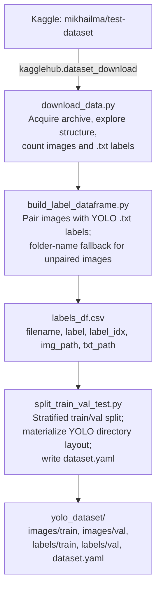

# Dataset Preparation Module

This directory implements the data-acquisition, labeling, and
train/validation-split stage of the *Breaking reCAPTCHAv2* pipeline. It
transforms the raw Kaggle image archive into a YOLO-formatted dataset
(`images/{train,val}`, `labels/{train,val}`, `dataset.yaml`) consumed by all
downstream stages (`../preprocessing/`, `../cyclegan/`,
`../pseudo_labeling/`, `../yolov8/`).

## 1. Data Source

The base image corpus is the publicly available Kaggle dataset
**`mikhailma/test-dataset`** ("Google reCAPTCHA v2 Images Dataset"):

> https://www.kaggle.com/datasets/mikhailma/test-dataset

The dataset is retrieved programmatically via the `kagglehub` Python client:

```python
import kagglehub
path = kagglehub.dataset_download("mikhailma/test-dataset")
```

The archive contains a large collection of reCAPTCHAv2-style image tiles
organized into class-named subdirectories, together with a partial set of
YOLO-format (`.txt`) bounding-box annotations covering a 3-class subset of
the full object taxonomy (see Section 3).

## 2. Pipeline Overview



## 3. Class Taxonomy and the Annotation-Coverage Problem

Two distinct class vocabularies are used and must not be conflated:

| Vocabulary | Size | Classes | Source |
|---|---|---|---|
| **Full reCAPTCHAv2 taxonomy** (`config.TAXONOMY_CLASSES`) | 12 | Bicycle, Bridge, Bus, Car, Chimney, Crosswalk, Hydrant, Motorcycle, Other, Palm, Stair, Traffic Light | Derived from the dataset's class-named subdirectory structure |
| **Raw ground-truth annotation subset** (`config.RAW_ANNOTATION_CLASS_MAP`) | 3 | Chimney, Crosswalk, Stair | Actual class indices found inside the shipped YOLO `.txt` files |

This asymmetry — a 12-class folder taxonomy but only 3 classes with
pixel-accurate bounding-box ground truth — is a defining characteristic of
this dataset and directly motivates the pseudo-labeling stage
(`../pseudo_labeling/`): images belonging to the remaining 9 taxonomy
classes have *category*-level labels (from their folder) but no
bounding-box annotations, so a pretrained detector is later used to
generate pseudo bounding boxes for them once they are CycleGAN-enhanced.

`dataset.yaml`'s `names` field is therefore populated from
`RAW_ANNOTATION_CLASS_MAP` (the classes the detector is directly supervised
on from ground truth), not from the full 12-class taxonomy — see
`split_train_val_test.infer_detection_classes()`.

## 4. Labeling Strategy

Implemented in `build_label_dataframe.py`:

1. **Direct pairing.** Every YOLO `.txt` annotation file is matched to an
   image of the same base filename (same directory first, full-archive
   search as a fallback). The image's dominant label is taken as the class
   of the *first* bounding box in its annotation file.
2. **Folder-name fallback.** Images with no `.txt` counterpart are labeled
   by case-insensitive substring matching of their parent-directory name
   against the 12-class taxonomy (defaulting to `"Other"` on no match).
3. **Coverage-triggered full fallback.** If step 1 yields ground-truth
   labels for less than 10% of all discovered images (`--fallback_threshold`,
   default `0.10`), step 2 is applied to the *entire* image set rather than
   only the unpaired remainder, ensuring the stratified split in Section 5
   is never bottlenecked by sparse annotation coverage.

This design maximizes retained training data (every discoverable image
gets a usable label for stratification purposes) while keeping the
provenance of each label — ground-truth bounding box vs. folder-inferred
category — explicit via the `txt_path` column (`NaN` for folder-inferred
labels) in `labels_df.csv`.

## 5. Train/Validation Split

`split_train_val_test.py` performs an 80/20 stratified split
(`--val_ratio`, default `0.2`) on `labels_df.csv`'s `label` column using
`sklearn.model_selection.train_test_split` with a fixed random seed
(`--seed`, default `42`) for reproducibility. If any class has fewer than 2
samples (stratification is infeasible) the script automatically falls back
to a non-stratified random split and logs the fallback explicitly, so the
split strategy actually used for a given run is always auditable from the
console log.

Images without a ground-truth `.txt` file are still copied into the split
and receive an **empty** `.txt` label file, following the YOLO convention
for background/unannotated images — this preserves dataset size for the
CycleGAN and pseudo-labeling stages without producing an invalid YOLO
training layout.

## 6. Repository Contents

```
dataset_preparation/
├── README.md                    # this file
├── config.py                    # class taxonomy, annotation class map, split/seed constants
├── download_data.py             # Kaggle acquisition + directory/label exploration
├── build_label_dataframe.py     # image-label pairing + folder-name fallback labeling
└── split_train_val_test.py      # stratified split + YOLO directory layout + dataset.yaml
```

## 7. Usage

### 7.1 Environment

```bash
pip install kagglehub pandas scikit-learn tqdm
```

A Kaggle API token must be configured for `kagglehub` (see
[Kaggle API documentation](https://www.kaggle.com/docs/api) — place your
`kaggle.json` credentials file as instructed, or authenticate via
`kagglehub.login()`).

### 7.2 Step-by-step execution

```bash
# 1. Download the dataset and inspect its structure
python download_data.py --dataset_ref mikhailma/test-dataset

# 2. Pair images with labels and build the label dataframe
python build_label_dataframe.py --dataset_folder <path_printed_by_step_1> --output_csv labels_df.csv

# 3. Stratified split + YOLO directory layout
python split_train_val_test.py --labels_csv labels_df.csv --output_dir ./yolo_dataset
```

After step 3, `./yolo_dataset/` is a complete YOLO-format dataset ready to
be consumed by `../preprocessing/`, `../cyclegan/`, and, once pseudo-labels
are merged in, `../yolov8/train_yolov8.py`.

### 7.3 Output artifacts

| File | Produced by | Description |
|---|---|---|
| `labels_df.csv` | `build_label_dataframe.py` | One row per image: `filename, label, label_idx, img_path, txt_path` |
| `yolo_dataset/images/{train,val}/` | `split_train_val_test.py` | Split image files |
| `yolo_dataset/labels/{train,val}/` | `split_train_val_test.py` | YOLO-format `.txt` label files (empty for unannotated images) |
| `yolo_dataset/dataset.yaml` | `split_train_val_test.py` | YOLOv8 dataset configuration (`path`, `train`, `val`, `nc`, `names`) |

## 8. Reproducibility Notes

- All randomized operations (train/val split) use a fixed seed
  (`RANDOM_SEED = 42` in `config.py`), passed explicitly to
  `train_test_split`.
- `MAX_LABEL_FILES` (default `1000`) caps the number of `.txt` files
  scanned during pairing, matching the reduced-scale experimental setup
  used for the reported results under limited compute (Colab-scale GPUs).
  Increase or set to `None` for full-dataset runs.
- Every script prints its resolved configuration and summary statistics
  (image/label counts, class distribution, split sizes) to stdout, so a
  full run log is sufficient to audit exactly which data entered the
  pipeline for a given experiment.

## 9. Limitations

- Because the dominant-label heuristic (Section 4, step 1) assigns only the
  *first* bounding box's class to a multi-object image, `labels_df.csv`'s
  `label` column should be treated as a **stratification/bookkeeping label**,
  not as a complete multi-label ground truth; the full multi-object
  annotation is preserved unmodified in each image's YOLO `.txt` file.
- Folder-inferred labels (`txt_path` is `NaN`) carry category-level
  supervision only; they are not used as detection ground truth until
  pseudo-labels are generated for them in `../pseudo_labeling/`.
