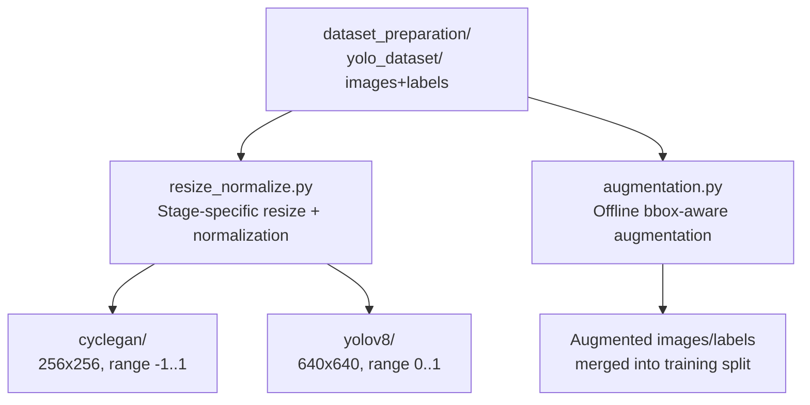

# Preprocessing Module

This directory implements the image resizing, normalization, and
bounding-box-aware augmentation applied to the YOLO-format dataset produced
by `../dataset_preparation/`, before it is consumed by `../cyclegan/` and
`../yolov8/`.

## 1. Pipeline Position



`resize_normalize.py` and `augmentation.py` serve two different purposes
and are typically used at different points in an experimental run:
`resize_normalize.py` defines the exact per-stage resizing/normalization
convention (and can optionally materialize a resized copy of the dataset
to disk), while `augmentation.py` produces additional, geometrically and
photometrically perturbed training samples.

## 2. Resizing and Normalization Conventions (`resize_normalize.py`)

Three distinct resizing/normalization conventions are used across the
pipeline, and this module is the single source of truth for each, so that
`../cyclegan/dataset.py`, `../yolov8/`, and `../evaluation/` all remain
consistent with what is documented here:

| Stage | Target resolution | Value range | Interpolation | Rationale |
|---|---|---|---|---|
| CycleGAN (`cyclegan_transform`) | 256 x 256 (square resize) | `[-1, 1]` | Bilinear | Matches the generator's `Tanh` output activation and `InstanceNorm2d`-based architecture (see `../cyclegan/README.md`) |
| YOLOv8 (`yolo_transform`) | 640 x 640 (square resize) | `[0, 1]` | Bilinear | Ultralytics' standard YOLOv8 input convention |
| YOLO-style letterbox (`resize_keep_aspect_pad`) | 640 x 640 (aspect-preserving + padding) | `[0, 255]` (uint8) | Bilinear, constant padding (RGB 114,114,114) | Reproduces Ultralytics' internal inference-time preprocessing outside of the `ultralytics` API, for parity when preprocessing images manually (e.g. before pseudo-label generation) |

Square (non-aspect-preserving) resizing is used for the CycleGAN and direct
YOLOv8-training transforms, consistent with the transforms already applied
in `../cyclegan/dataset.py` and by Ultralytics' training-time data loader.
The aspect-preserving letterbox variant is provided separately for cases
where preprocessing happens *outside* the Ultralytics training/inference
API (e.g., a custom preprocessing script feeding `../pseudo_labeling/`)
and must match Ultralytics' own inference-time behavior exactly to avoid a
train/inference resizing mismatch.

### 2.1 Usage

```bash
# Materialize a 256x256 resized copy for offline inspection (CycleGAN convention)
python resize_normalize.py \
    --input_dir /content/yolo_dataset/images/train \
    --output_dir /content/yolo_dataset_256/images/train \
    --target_size 256 --mode cyclegan

# Materialize a 640x640 letterboxed copy (YOLO inference-time convention)
python resize_normalize.py \
    --input_dir /content/yolo_dataset/images/train \
    --output_dir /content/yolo_dataset_640/images/train \
    --target_size 640 --mode yolo_letterbox
```

The `cyclegan_transform()` and `yolo_transform()` functions are also
importable directly (`from resize_normalize import cyclegan_transform`) for
use inside a `torch.utils.data.Dataset.__getitem__`, avoiding the need to
materialize a resized copy to disk when on-the-fly resizing is sufficient.

## 3. Data Augmentation (`augmentation.py`)

### 3.1 Relationship to YOLOv8's built-in augmentation

`../yolov8/train_yolov8.py` already enables Ultralytics' built-in,
on-the-fly augmentation during training (mosaic, mixup, copy-paste, HSV
color jitter, rotation, translation, scale jitter), re-sampled fresh every
epoch. `augmentation.py` provides a complementary **offline** augmentation
pass, used specifically when:

1. an experiment requires a *fixed*, inspectable augmented dataset held
   constant across multiple training runs (for controlled ablations), which
   on-the-fly augmentation cannot provide since it re-samples every epoch; or
2. specific minority classes in the 12-class taxonomy (see
   `../dataset_preparation/README.md`, Section 3) need to be deliberately
   oversampled before the pseudo-labeling stage, independent of Ultralytics'
   uniform per-epoch sampling.

### 3.2 Transform pipeline and rationale

Implemented with `albumentations.Compose` and `BboxParams(format="yolo")`
so that geometric transforms are applied consistently to both the image and
its YOLO-format bounding-box labels:

| Transform | Parameters | Rationale |
|---|---|---|
| `HorizontalFlip` | p=0.5 | reCAPTCHAv2 object classes (vehicles, hydrants, traffic lights, stairs, ...) are not orientation-dependent; label-preserving |
| `RandomBrightnessContrast` | brightness/contrast limit 0.2, p=0.5 | Simulates the variable outdoor lighting conditions present in Street-View-sourced reCAPTCHA tiles |
| `HueSaturationValue` | hue ±10, sat ±25, val ±15, p=0.4 | Additional photometric robustness, complementing the CLAHE-based test-time enhancement in `../evaluation/` |
| `ShiftScaleRotate` | shift 0.05, scale 0.1, rotate ±10°, p=0.5 | Mild geometric jitter; rotation range matches the `degrees=10.0` setting used in YOLOv8 on-the-fly augmentation for consistency across offline/online augmentation |
| `GaussianBlur` / `ISONoise` (`OneOf`) | p=0.3 (combined) | Simulates compression artifacts and sensor noise typical of low-resolution reCAPTCHA tiles |
| `RandomResizedCrop` | scale (0.8, 1.0), ratio (0.9, 1.1), p=0.3 | Encourages scale invariance, particularly relevant for small-object classes (Traffic Light, Hydrant) |
| `Resize` | target size (default 640) | Final resize to the detector's input resolution |

### 3.3 Usage

```bash
python augmentation.py \
    --images_dir /content/yolo_dataset/images/train \
    --labels_dir /content/yolo_dataset/labels/train \
    --output_images_dir /content/yolo_dataset_aug/images/train \
    --output_labels_dir /content/yolo_dataset_aug/labels/train \
    --multiplier 2
```

`--multiplier` controls how many augmented variants are generated per
source image (default `2`: total dataset size after merging = `3x` the
original for the augmented split). Augmented image/label pairs are written
with a `_aug{i}` filename suffix and can be merged directly into
`yolo_dataset/images/train` and `yolo_dataset/labels/train` prior to
running `../yolov8/train_yolov8.py`.

## 4. Repository Contents

```
preprocessing/
├── README.md               # this file
├── resize_normalize.py     # stage-specific resize/normalize transforms + batch CLI
└── augmentation.py         # albumentations-based offline bbox-aware augmentation
```

## 5. Ablation Table Template

The table below is the intended format for reporting the effect of each
preprocessing/augmentation component on final detection performance (e.g.
as an ablation table in the paper's Results section). **The cells below are
placeholders (`TBD`) and must be filled in with the actual metrics produced
by running `../evaluation/compute_metrics.py` on checkpoints trained under
each configuration** — no results are fabricated here, since only real,
reproduced experimental runs can populate this table validly.

| Configuration | CycleGAN enhancement | Offline augmentation | mAP@0.5 | mAP@0.5:0.95 | Precision | Recall |
|---|:---:|:---:|:---:|:---:|:---:|:---:|
| Baseline (raw images only) | ✗ | ✗ | TBD | TBD | TBD | TBD |
| + CycleGAN-enhanced images | ✓ | ✗ | TBD | TBD | TBD | TBD |
| + Offline augmentation only | ✗ | ✓ | TBD | TBD | TBD | TBD |
| Full pipeline (CycleGAN + augmentation + pseudo-labels) | ✓ | ✓ | TBD | TBD | TBD | TBD |

To populate this table:

```bash
# For each configuration, train with the relevant data included/excluded,
# then evaluate the resulting checkpoint:
python ../evaluation/compute_metrics.py \
    --weights <path_to_checkpoint>/best.pt \
    --data <path_to_corresponding_dataset.yaml> \
    --output_dir ./ablation_results/<configuration_name>
```

The resulting `metrics_summary.json` for each run provides the exact values
to substitute into the table above.

## 6. Reproducibility Notes

- `resize_normalize.py`'s `cyclegan_transform()` and `yolo_transform()`
  must remain byte-for-byte consistent with the transforms used inside
  `../cyclegan/dataset.py` and the Ultralytics training pipeline
  respectively; any change here should be mirrored there (or refactored
  into a shared import) to avoid a silent train/inference preprocessing
  mismatch.
- `augmentation.py` uses a fixed random seed (`--seed`, default `42`) for
  the Python `random` module; note that `albumentations` transform
  sampling itself is driven by NumPy's global RNG, so for full determinism
  also seed `numpy.random.seed(args.seed)` before calling the pipeline if
  bit-exact reproducibility across runs is required.
- Images with no ground-truth bounding boxes (folder-inferred labels only;
  see `../dataset_preparation/README.md`, Section 4) are still augmented
  (photometric and geometric transforms are still meaningful for them) but
  are written with an empty `.txt` label file, consistent with the YOLO
  convention used throughout this project.
